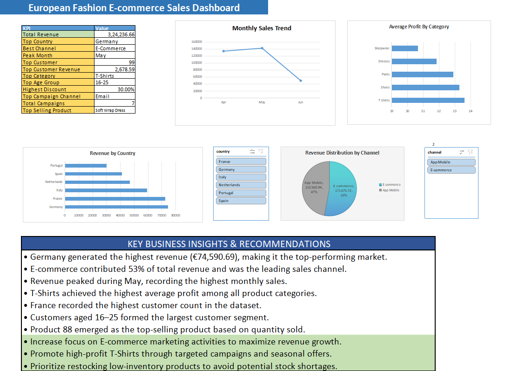

# European Fashion E-commerce Sales Dashboard

## Project Overview

This project analyzes a European fashion e-commerce dataset using Excel/WPS Office. An interactive dashboard was created to evaluate sales performance, customer behavior, product profitability, marketing campaigns, and sales channels.

The dashboard enables users to explore business performance through KPI metrics, visualizations, slicers, and actionable business insights.

---

## Tools Used

- Excel / WPS Office
- Pivot Tables
- Pivot Charts
- Slicers
- Dashboard Design
- Data Analysis

---

## Dataset Files

The analysis was performed using the following datasets:

- Sales
- Sales Items
- Customers
- Products
- Campaigns
- Channels

---

## Key Performance Indicators (KPIs)

- Total Revenue
- Top Revenue Country
- Best Sales Channel
- Peak Sales Month
- Top Customer
- Top Customer Revenue
- Top Category
- Largest Customer Age Group
- Highest Discount Offered
- Top Campaign Channel
- Total Campaigns
- Top Selling Product

---

## Dashboard Features

### Monthly Sales Trend
Tracks revenue performance across months.

### Revenue by Country
Compares revenue generated by different countries.

### Revenue Distribution by Channel
Analyzes revenue contribution from E-commerce and App Mobile channels.

### Average Profit by Category
Evaluates profitability across product categories.

### Interactive Slicers
Allows filtering by:

- Country
- Sales Channel

---

## Key Business Insights

- Germany generated the highest revenue (€74,590.69).
- E-commerce contributed 53% of total revenue and emerged as the leading sales channel.
- Revenue peaked during May.
- T-Shirts achieved the highest average profit among all product categories.
- France recorded the highest customer count.
- Customers aged 16–25 formed the largest customer segment.
- Product 88 (Soft Wrap Dress) emerged as the top-selling product.

---

## Business Recommendations

- Increase focus on E-commerce marketing activities to maximize revenue growth.
- Promote high-profit T-Shirts through targeted campaigns and seasonal offers.
- Prioritize restocking low-inventory products to avoid potential stock shortages.

---

## Dashboard Preview

The dashboard provides a comprehensive overview of sales performance, customer behavior, product profitability, and channel effectiveness.

## Project Outcome

This dashboard provides a clear overview of sales performance and customer trends while supporting data-driven business decisions through interactive visualizations and actionable insights.
